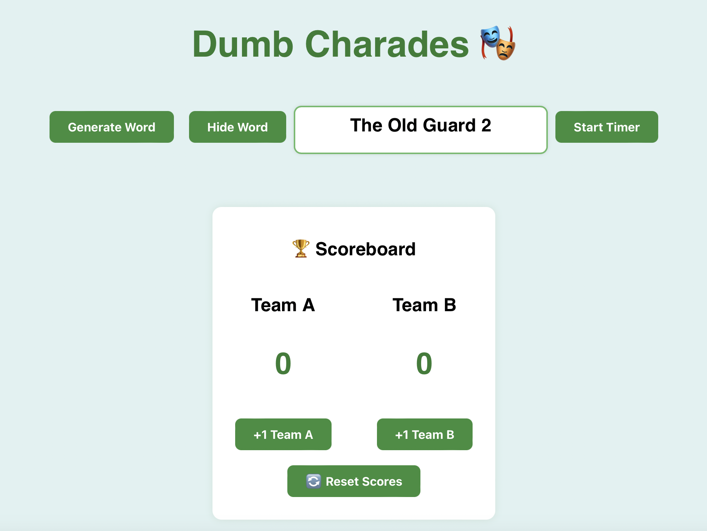

# 🎭 Dumb Charades Game (React)

A fun and interactive web app for playing Dumb Charades — perfect for game nights, parties, or online gatherings!

## ✨ Features

- 🎬 Random movie prompt generator
- ⏲️ Countdown timer with visual feedback
- 🟢 Clean and responsive UI
- 📣 “Time’s Up” message at end of timer
- 🏆 Scoreboard to track team points
- 💻 Built with React, HTML, CSS (no external styling libraries)

## Screenshot

### Dumb Charades


## Tech Stack

- React
- JavaScript (ES6+)
- HTML/CSS

## Installation

```bash
git clone https://github.com/shrikantbk06/dumb-charades.git
cd dumb-charades/client
npm install
npm start
